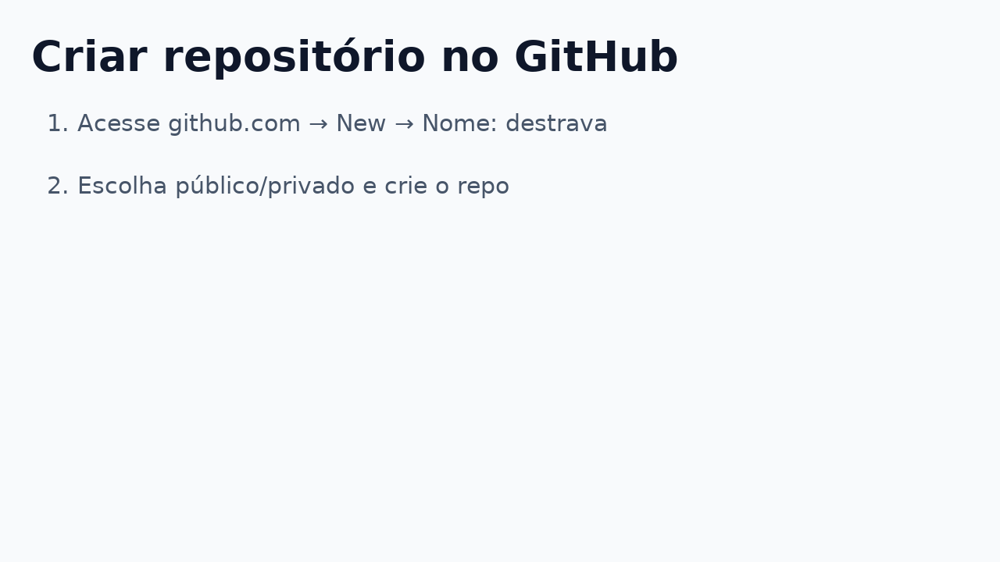
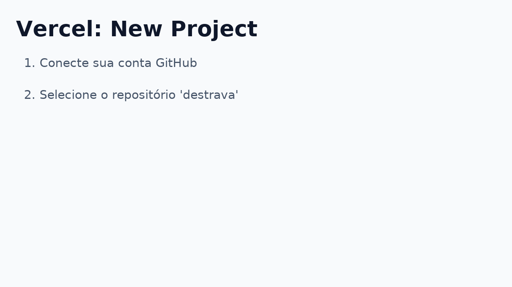
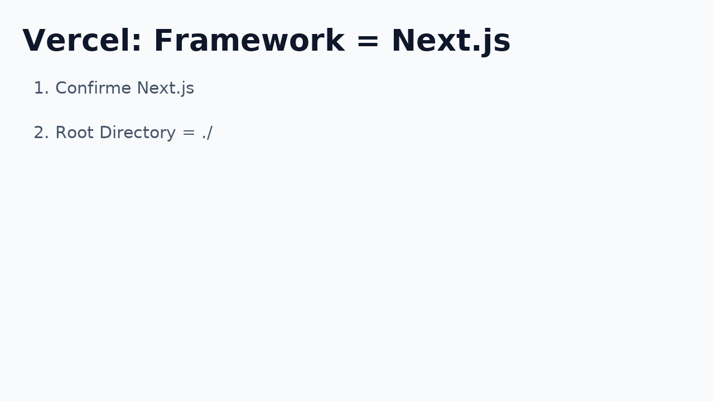
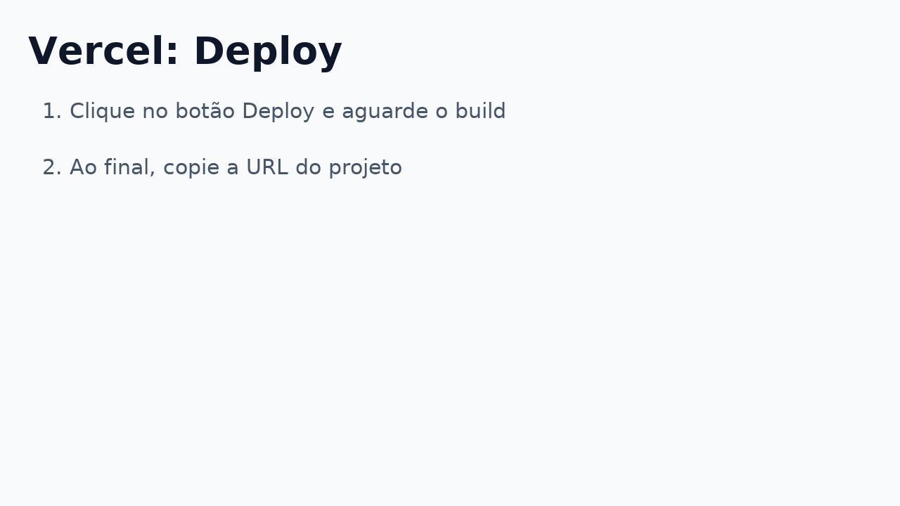
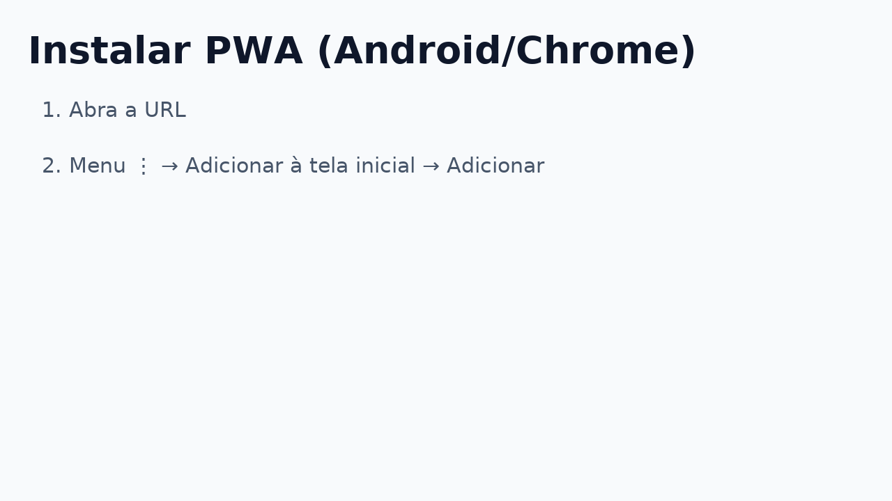
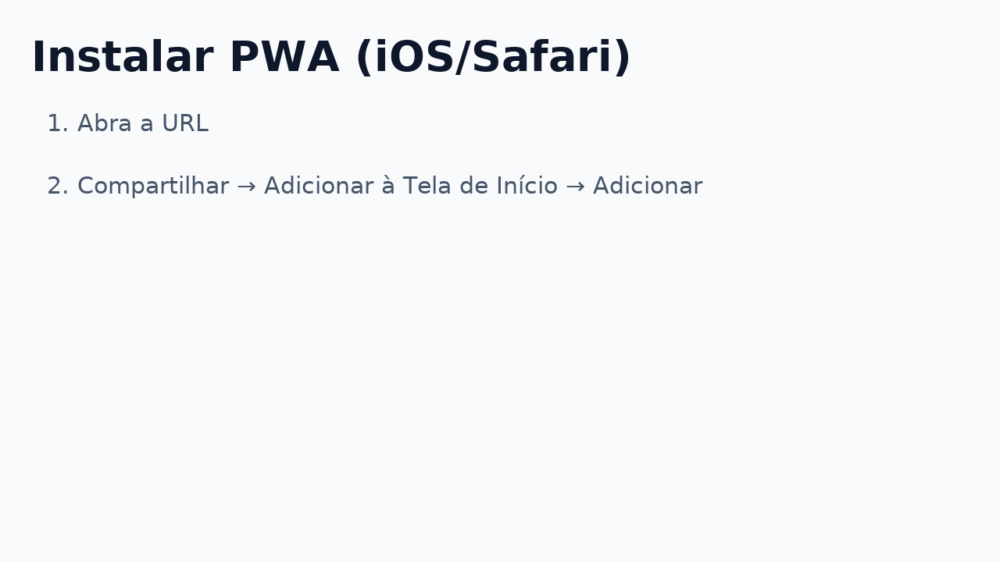
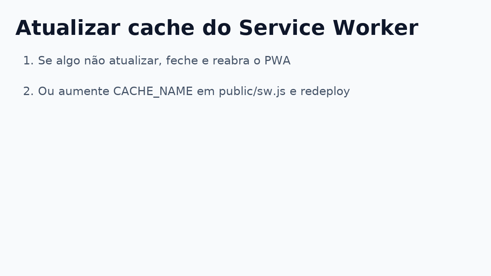

# Destrava — PWA (Next.js, App Router)

MVP completo para rodar como **aplicativo instalável** no celular:
**Home → Captura → Plano → Timer (2 → 25 min) → Check-out → Painel** + **Config**.

---

## 🚀 Rodando local
```bash
npm install
npm run dev
# http://localhost:3000
```

---

## ☁️ Deploy na Vercel (passo a passo)

**1) GitHub – criar repositório**  


**2) Vercel – New Project**  


**3) Vercel – Framework**  
Selecione **Next.js** e mantenha Root = `./`.  


**4) Deploy**  
Clique **Deploy** e aguarde. No final, pegue a URL do tipo `https://destrava.vercel.app`.  


---

## 📲 Instalar como app (PWA)
**Android (Chrome):**  


**iOS (Safari):**  


Após instalar, o **Destrava** abre em tela cheia com ícone na tela inicial.

---

## ✅ Como usar (fluxo)
1. **Home** → Procrastinei / Iniciar foco  
2. **Captura** → Task + sensação + distrator → **Gerar plano**  
3. **Plano** → 1º passo (2min), bloco (25/15), recompensa → **Iniciar 2 min**  
4. **Timer** → 2:00 → **Continuar 25 min** → **Check-out**  
5. **Check-out** → Concluí / Parcial / Travou + próximo passo  
6. **Painel** → horários críticos, % sair-do-zero, últimos check-outs  
7. **Config** → seu **Porquê** e **Recompensa padrão**

> Os dados ficam **no seu dispositivo** (localStorage).

---

## 🧰 Estrutura de pastas
```
app/
  captura/      # form "Procrastinei agora"
  plano/        # plano do agora + share WhatsApp
  timer/        # timer 2 → 25
  checkout/     # check-out + próximo passo
  painel/       # estatísticas simples
  config/       # porquê & recompensa
  sobre/        # info
public/
  manifest.json # PWA
  sw.js         # Service Worker (cache básico)
  icons/        # ícones do app
src/
  plan.ts       # gerador de plano (mock IA)
  storage.ts    # persistência local (localStorage)
```

---

## 🛟 Troubleshooting


1) **Links não abrem**  
   - Links internos: use `<Link href="/rota">` (já aplicado).  
   - Links externos no iOS PWA: use `target="_blank"` (já aplicado).

2) **Mudanças não aparecem**  
   - Feche e reabra o PWA.  
   - Ou aumente `CACHE_NAME` em `public/sw.js`, salve/commit e redeploy.

3) **PWA não oferece instalar**  
   - Acesse via **HTTPS** (Vercel OK).  
   - Visite a home 2–3 vezes; o Chrome ativa o “Add to Home Screen”.

4) **Timer pausado quando bloqueia a tela**  
   - Normal no navegador; ao reabrir ele retoma. Para máximo controle, migre para app nativo no futuro.

---

## 🧩 Próximos passos (sugestões)
- Integração **Trello**: criar card e checklist via API.  
- Integração **Google Calendar**: criar evento de bloco de foco.  
- Autenticação (Supabase) para sincronizar entre dispositivos.  
- Push notifications (Android PWA; iOS requer passos extras).

---

## 🔒 Privacidade
Sem servidor. Os dados ficam no seu **localStorage**. Para limpar, apague dados do site nas configurações do navegador.

---

## 📜 Licença
Uso livre neste beta com o grupo do Bruno.
